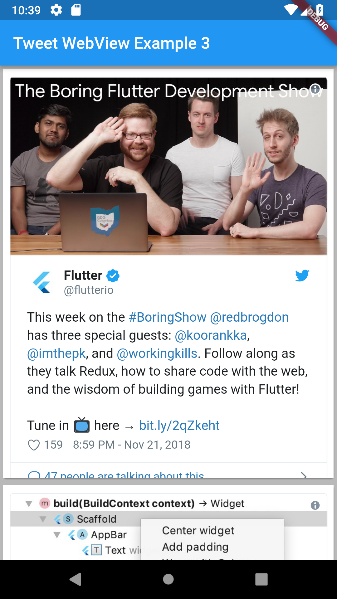

# TweetWebView for Flutter 

[](https://travis-ci.org/larryaasen/tweet_webview)    [](https://codecov.io/gh/larryaasen/tweet_webview) [](https://pub.dartlang.org/packages/tweet_webview)

TweetWebView is a Flutter widget to easily display a Twitter tweet in a WebView widget using [webview_flutter](https://pub.dartlang.org/packages/webview_flutter).

## Example 1
Display a single tweet in a TweetWebView widget using the tweet URL.

```dart
class _MyHomePageState extends State<MyHomePage> {
  @override
  Widget build(BuildContext context) {
    return Scaffold(
      appBar: AppBar(
        title: Text('Tweet WebView Example 1'),
      ),
      body: TweetWebView.tweetUrl("https://twitter.com/Interior/status/463440424141459456"),
    );
  }
}
```

[](screenshots/example1.png)

## Example 2
Display a single tweet in a TweetWebView widget using the tweet ID.

```dart
class _MyHomePageState extends State<MyHomePage> {
  @override
  Widget build(BuildContext context) {
    return Scaffold(
      appBar: AppBar(
        title: Text('Tweet WebView Example 2'),
      ),
      body: TweetWebView.tweetID('463440424141459456'),
    );
  }
}
```

[](screenshots/example2.png)

## Example 3
Display a list of tweets in TweetWebView widgets using the tweet IDs.

```dart
class _MyHomePageState extends State<MyHomePage> {
  @override
  Widget build(BuildContext context) {
    return Scaffold(
      appBar: AppBar(
        title: Text('Tweet WebView Example 3'),
      ),
      body: _buildBody(),
    );
  }

  Widget _buildBody() {
    final tweets = ['1065424382292566017', '1068219397293125633', '1068551446029832192', '1065362290512293888'];

    final list = ListView.builder(
      scrollDirection: Axis.vertical,
      padding: EdgeInsets.fromLTRB(0.0, 0.0, 0.0, 0.0),
      itemCount: tweets.length,
      itemBuilder: (context, index) {
        var tweetID = tweets[index];
        return Card(
          child: TweetWebView.tweetID(tweetID),
        );
      },
    );

    final container = Container(
        color: Colors.black26,
        child: Center(child: list)
    );

    return container;

  }
}
```

[](screenshots/example3.png)

## Contributing
All [comments](https://github.com/larryaasen/tweet_webview/issues) and [pull requests](https://github.com/larryaasen/tweet_webview/pulls) are welcome.